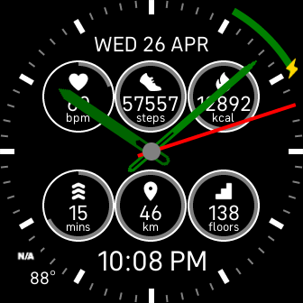

# 概要
試作中の Fitbit クロックフェイスです。

# 機能
- インダイヤルで種々の情報を表示します
- 時計の針または軸をタップすると針の表示をトグルします。(針で表示が見えないときに使う想定)

# スクリーンショット

# 謝辞
心拍数、歩数、カロリー、AZM、距離および昇降アイコンは sdk-design-assets を使っています。
https://github.com/Fitbit/sdk-design-assets

天気アイコンは Weather Icons を使っています。
https://erikflowers.github.io/weather-icons/
